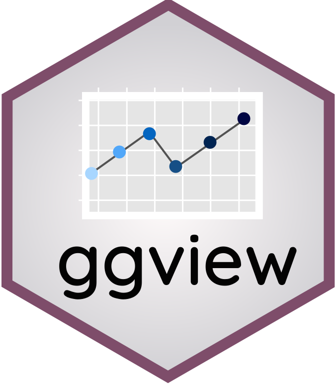
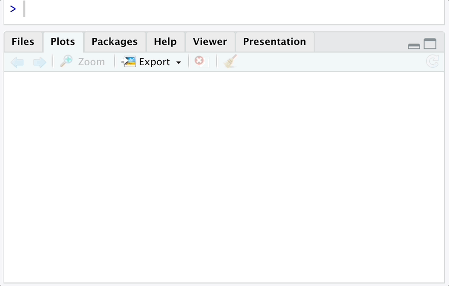

# ggview 
-----------

<!-- badges: start -->
[](https://CRAN.R-project.org/package=ggview)
[](https://github.com/idmn/ggview/actions/workflows/R-CMD-check.yaml)
<!-- badges: end -->

Choose the right picture size for a ggplot without leaving your IDE.

1. Set picture dimensions with the `canvas()` element.



2. Save the plot with `save_ggplot()`.

```R
p <- 
  ggplot(mtcars, aes(wt, mpg)) +
  geom_point() +
  ggtitle("My Plot") +
  canvas(800, 1000, units = "px")

save_ggplot(p, "my_plot.png")
```

### Installation

```r
install.packages("ggview")

# development version
remotes::install_github("idmn/ggview")
```

### VS Code

The package relies on the `rstudioapi::viewer()` function to display plot previews. By default it 
does not work in VS Code, but installing the [R extension](https://marketplace.visualstudio.com/items?itemName=REditorSupport.r) fixes it. It tricks the `rstudioapi` package into believing it is running in RStudio, and everything works.
